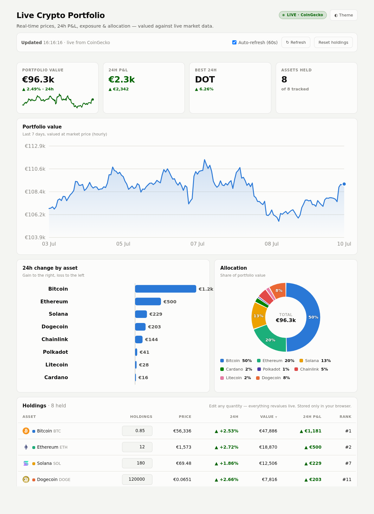

# Live Crypto Portfolio Dashboard

A **real-time** crypto portfolio dashboard powered by the public **CoinGecko API** —
live prices, 24h P&L, allocation and a 7-day value curve, with **editable holdings**.
Built entirely client-side with **hand-drawn SVG charts** (no chart library, no backend).

**Live:** https://sadiqk2.github.io/portfolio-dashboard



## Highlights

- **Live data** — prices, 24h change, market cap and 7-day sparklines fetched from CoinGecko; auto-refreshes every 60s with a visible "last updated" time.
- **Editable holdings** — change any quantity and the whole dashboard revalues instantly; your holdings persist in `localStorage` (nothing is sent anywhere).
- **KPI tiles** — portfolio value (with live trend sparkline), 24h P&L, best 24h mover, assets held.
- **Portfolio value** — real 7-day curve (summed from each asset's sparkline × your quantity) with a hover crosshair + tooltip.
- **24h change by asset** — diverging bars; **allocation** donut with direct labels; sortable holdings table with coin logos.
- Light **and** dark themes; responsive; `prefers-reduced-motion` respected.

## How the real-time part works

GitHub Pages is static, so the browser calls CoinGecko directly. That API is
**keyless and CORS-enabled** (`access-control-allow-origin: *`), so a static site can
fetch it with no server and no secret:

```
GET https://api.coingecko.com/api/v3/coins/markets
      ?vs_currency=eur&ids=bitcoin,ethereum,…&sparkline=true&price_change_percentage=24h
```

If the API rate-limits (HTTP 429 on the free tier), the dashboard keeps the last
good data and shows a clear status message.

## Design notes

Chart colors follow a **CVD-safe categorical palette** validated against a
colorblindness + contrast checker (fixed hue order; donut segments carry direct
labels and 2px gaps as secondary encoding). Diverging 24h P&L uses a blue↔red pair
with a neutral zero axis; status green/red is reserved for gain/loss text only.

## Run locally

```bash
python3 -m http.server 8000   # open http://localhost:8000
```

Single `index.html`, no build step.
